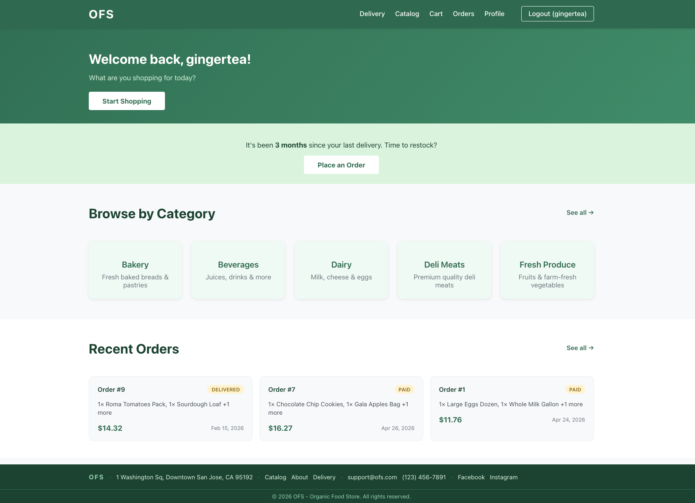
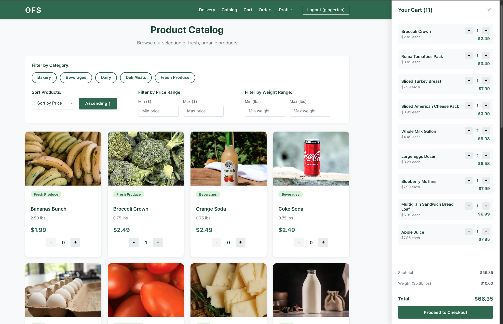
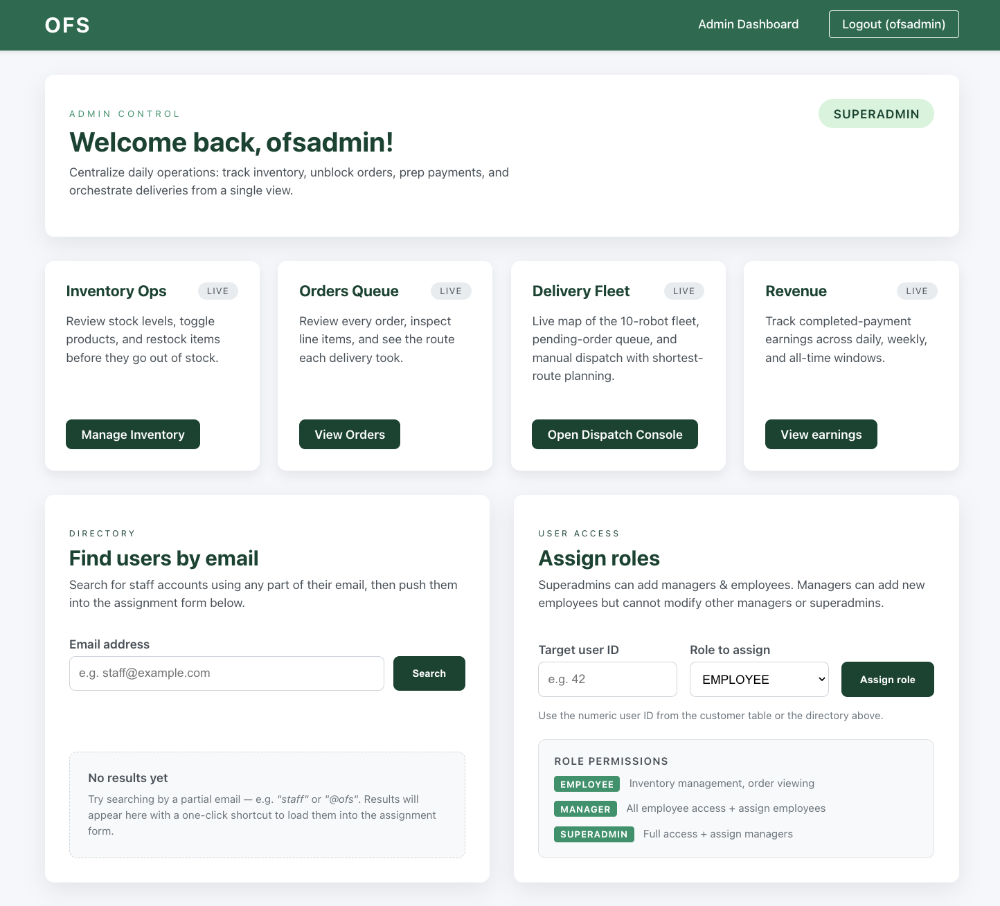
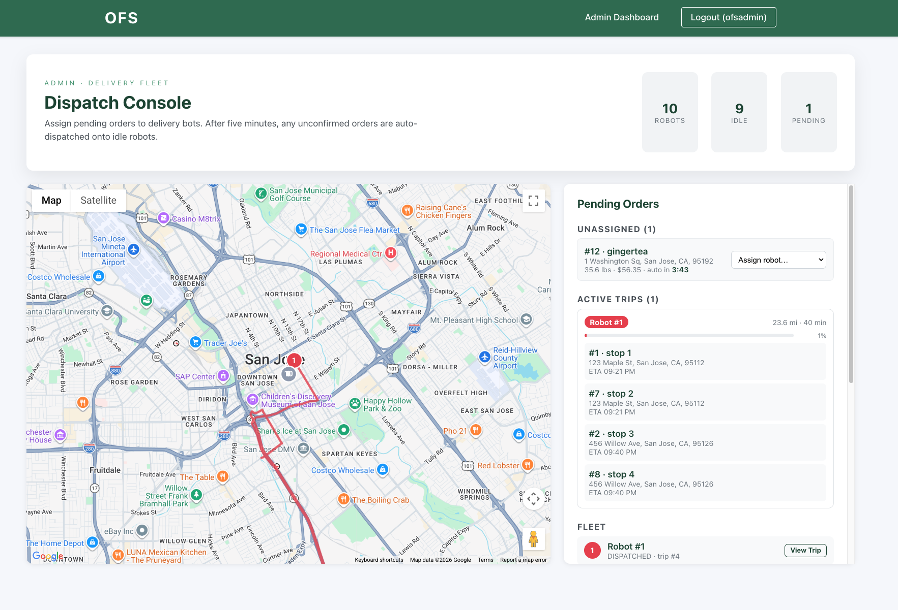
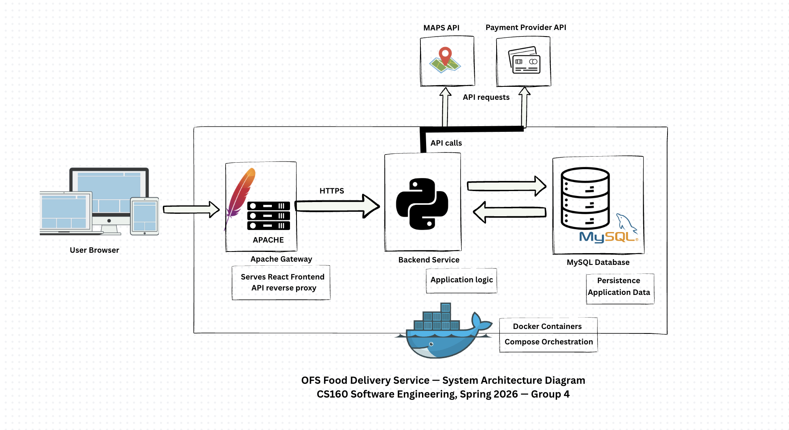

# git-groceries - Online Food Delivery Service

A full-stack food delivery platform for a local organic retailer in the San Jose Downtown area. Customers can browse products, manage carts, place orders with Stripe-backed payments, and track deliveries in real time. An admin dashboard covers order management, dispatch, inventory, and revenue reporting.

> Semester project for Spring-2026-CS160: Software Engineering at San Jose State University.

## Tech Stack

- **Frontend**: React
- **Backend**: Flask (Python)
- **Database**: MySQL
- **Payments**: Stripe
- **Maps & Routing**: Google Maps API
- **Infrastructure**: Docker Compose, Apache (reverse proxy)

## Screenshots

| Dashboard | Product Catalog |
|-----------|----------------|
|  |  |

| Admin View | Fleet Dispatch |
|------------|---------------|
|  |  |

## Architecture



## Project Layout

- `backend/` — Flask API, business logic, and service integrations
- `frontend/` — React application
- `database/` — Schema, seed data, and migrations
- `apache/` — Reverse proxy configuration
- `tests/` — Test scripts and fixtures

## Quick Start

**Prerequisites**: Docker and Docker Compose installed.

1. Create a `.env` file at the repository root:

```bash
MYSQL_ROOT_PASSWORD=your_root_password
MYSQL_DATABASE=ofs
MYSQL_USER=ofs_user
MYSQL_PASSWORD=ofs_password
JWT_SECRET=your_jwt_secret
STRIPE_API_KEY=your_stripe_secret_key
GOOGLE_MAPS_API_KEY=your_google_maps_key
```

2. Create `frontend/.env`:

```bash
REACT_APP_STRIPE_PUBLISHABLE_KEY=your_stripe_publishable_key
REACT_APP_GOOGLE_MAPS_API_KEY=your_google_maps_key
```

3. Start the full stack:

```bash
docker compose up --build
```

4. Open the app:

| Service  | URL                    |
|----------|------------------------|
| Frontend | http://localhost:3000  |
| API      | http://localhost:5001  |

## Environment Variables

**Root `.env`**

| Variable              | Description                  |
|-----------------------|------------------------------|
| `MYSQL_ROOT_PASSWORD` | MySQL root password          |
| `MYSQL_DATABASE`      | Database name                |
| `MYSQL_USER`          | Application database user    |
| `MYSQL_PASSWORD`      | Application database password|
| `JWT_SECRET`          | Signing key for auth tokens  |
| `STRIPE_API_KEY`      | Stripe secret key            |
| `GOOGLE_MAPS_API_KEY` | Google Maps API key          |

**`frontend/.env`**

| Variable                          | Description                            |
|-----------------------------------|----------------------------------------|
| `REACT_APP_STRIPE_PUBLISHABLE_KEY`| Stripe publishable key                 |
| `REACT_APP_GOOGLE_MAPS_API_KEY`   | Google Maps API key for browser features|

## Common Commands

```bash
# Start the database, backend, frontend, and Apache proxy
docker compose up --build

# Stop the stack and remove local volumes (resets database)
docker compose down -v
```

## Database

Schema and seed data live in `database/`. The MySQL container loads the SQL files on first startup. Migrations live in `database/migrations/`. For a clean reset, run `docker compose down -v` and restart the stack.

## API Overview

Full endpoint reference: [endpoints.md](endpoints.md)

| Area        | Endpoints                                                         |
|-------------|-------------------------------------------------------------------|
| Auth        | Login, register, current user, role assignment                    |
| Products    | Categories, catalog, create/delete, image upload                  |
| Cart        | Per-customer cart access                                          |
| Checkout    | Stripe-backed payment flow                                        |
| Delivery    | Trip tracking and delivery zone validation                        |
| Admin       | Orders, robots, dispatch, revenue reporting, and trip detail      |

## Security Model

- **Public**: health check, login, register, product image serving
- **Authenticated**: all standard customer reads and writes
- **Role-protected**: admin, inventory, product management, and dispatch operations
- **Ownership-scoped**: customer profiles, addresses, carts, and trip views are restricted to the authenticated user

## Roles

| Role         | Access Level                                                         |
|--------------|----------------------------------------------------------------------|
| `CUSTOMER`   | Standard shopper account                                             |
| `EMPLOYEE`   | Product, inventory, and admin order access                           |
| `MANAGER`    | Broader admin and dispatch access                                    |
| `SUPERADMIN` | Full access including role management and operations                 |

## Testing

Backend tests live in `tests/`. Run them after starting the stack so the API can reach MySQL and supporting services.

```bash
./tests/test_endpoints.sh
./tests/test_customer_profiles.sh
```

## External Integrations

| Integration                     | Purpose                                           |
|---------------------------------|---------------------------------------------------|
| `backend/integrations/google_maps` | Geocoding and routing for delivery validation and ETA |
| `backend/integrations/stripe`   | Payment intent handling for checkout              |

**Stripe test card**: `4242 4242 4242 4242` — any future expiry date and any CVC.

## Troubleshooting

| Symptom                                  | Fix                                                                 |
|------------------------------------------|---------------------------------------------------------------------|
| Login or checkout fails                  | Confirm backend can reach MySQL and all API keys are set            |
| Frontend auth or maps features not working | Check `frontend/.env`                                             |
| Stale or corrupted data                  | Reset with `docker compose down -v` and restart                    |
