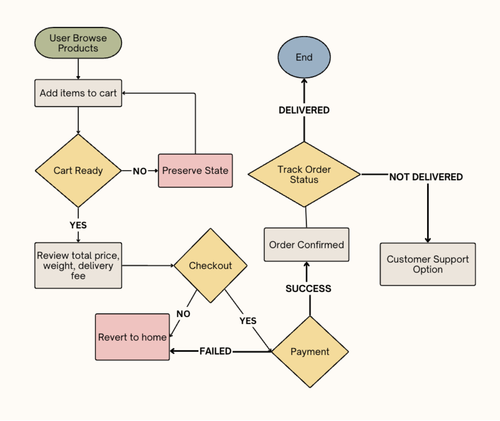

# OFS Food Delivery Service — Product Requirements Document

**Group #4**
Members: Sneha Basnet, Diya Dalal, Ansh Dhakalia, Kaizan Satta, Andy Van, Victoria Vo

CS160 Software Engineering
San Jose State University
Instructor: Frank Butt
Submission Date: February 18, 2025

---

## 1.1 Background

OFS, a local organic food retailer within Downtown San Jose, is looking for a web-based solution/platform in order to expand their business model. As a newly local retailer, OFS needs a full digital platform in order to compete with established players such as Instacart and Amazon Fresh while differentiating through autonomous robot delivery and cheaper pricing.

---

## 1.2 Problem Statement

OFS cannot compete in the modern grocery market without an integrated digital platform that enables online ordering, payment processing, and inventory management along with delivery services. The lack of these services creates the following challenges:

- **Revenue Loss:** OFS loses potential customers who expect online shopping and delivery.
- **Operation Loss:** OFS is currently required to manually process inventory, which is error-prone and makes real-time stock visibility difficult.
- **Competition:** Current players like Amazon Fresh and Instacart have a delivery infrastructure with a significant advantage.

This is important to bring up as Downtown San Jose's food market is competitive. Convenience is key as workers within the city have limited time for grocery shopping and prefer services that deliver to their homes or offices. Without a delivery system, OFS cannot serve customers. This directly impacts potential and market penetration. Below are the technical problems that will need to be solved.

### Weight-Aware E-commerce System

Traditional e-commerce platforms treat all products identically and calculate shipping based on flat rates or zones. OFS should implement a system where each product has its own weight attribute stored within the database, the shopping cart maintains a running total of item weights, delivery fees are calculated dynamically (rule shown later), and users have real-time feedback as they edit the cart. The shopping cart state management must track both price and weight totals with immediate updates to the frontend.

### Real-Time Inventory Tracking

In-store sales and online orders will deplete the same inventory, therefore there should be a system in place to track the total inventory. Without synchronization, customers would be able to order out-of-stock items, in-store items that are in someone's cart could be sold, and inventory would diverge from the actual physical amount.

Traditional inventory systems are batch updated (once a day or week) while OFS requires transaction-level accuracy to prevent overselling. To support concurrent orders, the system maintains a reserved quantity alongside the physical stock count, so items in active orders are held and cannot be double-sold before the order is confirmed.

### Delivery Optimization

Autonomous vehicles are constrained by a weight limit as well as an order limit. To save time and money, they must visit multiple addresses sequentially. This comes down to an optimization problem where maximum weight should be targeted alongside minimal customer waiting time. We can formulate the problem as follows: given N pending orders at different locations with different weights, determine which orders to batch together in order to minimize total wait time while maximizing weight utilization.

### Multi-Role System

The system must support four different user types and manage permissions:

- Customers need shopping and order tracking.
- Employees need to manage inventory, including adding or decrementing from certain items.
- Managers should get insights from the system and also be able to do what Employees do.
- A superadmin role exists for platform-level administration, with full access to all system functions including user role assignment.

### Support for External Dependencies

The system will use external libraries and will not operate in isolation. It must integrate with Stripe for credit card payment processing and with Google Maps for delivery zone validation, route polylines, and live traffic data to optimize routes. External APIs come with their own failures and inconsistencies, which the system should be able to handle without exposing internal errors to users.

---

## 1.3 Stakeholders and Personas

### Persona: Customer Feeding a Small Household

Jenna, age 20, is a full-time university student at San Jose State University studying for a bachelor's degree in Computer Science. Alongside her studies, she works part-time as a teaching assistant. She and her roommate, Jackie (age 21), share a living space within 15 minutes walking distance from their campus. Jackie is a student athlete on the track and field team. As part of her training, she keeps a relatively strict diet of healthy and nutritious meals. Jenna also prefers to eat healthy, so the two girls often eat the same foods and split the cost of groceries. Due to their busy schedules and heavy workloads, the girls have very little time for grocery shopping and cooking. They prefer ordering their groceries online with delivery services, and usually opt for ready-made meals or easy-to-prep meal ingredients.

**Scenario #1: Scheduling Conflicts**

Jenna and Jackie are in the middle of a particularly stressful midterms season and have been spending many nights staying up to study and work on projects. One late night, Jackie goes to the kitchen looking for something to give her the fuel she needs to power through the study session when she realizes that they're running alarmingly low on food. In the midst of the busy midterm season, both girls had forgotten to buy groceries for the week.

Unfortunately, there are very few windows of time where either of the girls will be home to receive any grocery deliveries. All week, they're booked for study sessions, group project meetings, office hours, sports training, etc. They need to be able to order their groceries online and have them delivered within one of the few time periods where one of them is home and available to bring the groceries in.

**Scenario #2: Out of Stock Products**

Jenna recently saw a viral new meal prep recipe online and wanted to try making it. She quickly searched up the ingredients on her favorite online grocery delivery website to add them to her cart and place an order. However, to her dismay, she saw that one of the key ingredients was out of stock. She put a bookmark on the recipe to save for later when she could get all the necessary ingredients. As a busy student, she hopes she doesn't forget to check later for when the ingredient may be restocked. In this scenario, it could be helpful to have a notification system for when a desired product is restocked. Additionally, similar alternatives to the desired product could be listed instead.

---

### Persona: Customer Feeding a Large Household

George, age 39, lives with his mother-in-law Lauren (age 62), his wife Sally (age 35), and their three kids Samantha (age 10), Peter (age 8), and Lindsey (age 6). Buying groceries for his large household of 6 can be a very time and energy consuming chore. It's challenging to find time to grab groceries between driving his kids to and from school, taking care of his elderly mother-in-law, and working his demanding full-time job at a car repair shop. George is not very technologically inclined so he is a bit suspicious of online grocery delivery services, but he thinks that if he can figure them out, they'll save him a lot of time and allow him to allocate his energy towards other ways to provide for his family.

**Scenario #1: Catering to Specific Preferences (and Allergens)**

Grocery lists in George's household could get hectic easily with everyone's different food preferences and needs. His mother-in-law's recent doctor's appointment revealed that she needed to cut back on sugar and sodium. The family also recently discovered that their youngest, Lindsey, was allergic to some nuts. In addition, Samantha believed that Honey Crisps were the best variety of apples, but Peter refused to eat anything other than green apples. George and Sally tried their best to cater to everyone's needs and most of everyone's wants when creating the grocery list each week. As a result, they are seeking easy and efficient methods of looking up products on an online grocery delivery website. They don't want to be spending too much time browsing through irrelevant products when they could be working on other things.

---

### Persona: Employee

Joe, age 24, works part time at OFS as a store associate. His responsibilities include preparing online orders for delivery and keeping store inventory counts updated. In order to ensure inventory numbers are kept consistent across online orders and in-person shoppers, OFS uses an online inventory tracking system where Joe can track the levels and counts of the store inventory and update them properly. During busy hours, Joe must manage many orders at once, so it's important the inventory system is fast and reliable. If the system doesn't operate properly, Joe may not realize items are out of stock or have low inventory, resulting in delivery delays or incorrect orders.

**Scenario #1: Updating Out of Stock and Low Inventory**

It is a busy hour at OFS, and Joe has an influx of orders rushing in. Products are running out fast, and it is difficult to keep track of how much inventory is flowing out. OFS gets a large delivery order report that must be completed ASAP. As Joe prepares the order, he realizes the inventory for one of the products is running low, and another one is out of stock. In the rush of the past few hours, he had forgotten to properly update inventory counts. Now, OFS won't be able to get new inventory in time to complete the order after they had already accepted it. It would be helpful for Joe if inventory counts could be automatically updated.

**Scenario #2: Tracking Online Orders**

Joe needs to manage packing online orders with his in-person store duties. He is unsure when he should start preparing online orders, and when they should be sent out to match the expected delivery time. He needs to consider factors such as the distance of the delivery destination, the size of the order, and the time the order was placed to determine which orders to start at first. It would be helpful for Joe if the system automatically calculated the times the orders should be sent out, so that way he can easily determine when to start preparing them.

---

## 1.4 Functional Requirements

The following go more in depth into the actual requirements briefly stated within the problem statement.

### Product Catalog and Browsing

- The system should present the OFS product catalog.
- Products should be organized into clearly defined sections such as fruits, dairy, grains, vegetables, meat, etc.
- Each product listing should display the product name, an image, unit price, and the weight, along with its inventory status. If the product is out of stock, a noticeable indicator should be shown to the user.

### Weight-Aware Shopping Cart

- The cart must go beyond price tracking. It should maintain a running sum of cumulative price and weight of all the items in the cart.
- It should update in real time so that if the user makes a change to the cart, it is reflected immediately.
- **Delivery fee logic:**
  - If the total weight of all items in the cart is below 20 pounds, delivery is free.
  - If it's at or over 20 pounds, a flat $10.00 charge will appear on the cart's breakdown. If the customer removes items that bring the total weight below 20 pounds, the charge should be removed.
- The system will enforce a max order weight of 200 pounds per order, the maximum payload of OFS's vehicle.

### Checkout and Payment Processing

Once a customer has finalized the cart, the system will guide them through a checkout process that collects and confirms the following:

- Delivery address, full order summary, delivery fee, and total fee.
- Stripe is used to handle payments securely. Credit card data is not stored within any OFS database; all payment data is handled exclusively by Stripe.
- Upon payment, the system should generate a unique order confirmation number along with an estimated delivery window allowing the customer to track their order.

### Customer Profile and Address Management

- Customers should be able to manage a personal profile that includes one or more saved delivery addresses. A default address can be designated and will be pre-populated at checkout to reduce friction for repeat orders.
- Customers can also set a substitution preference and add special delivery notes to their profile. These preferences are surfaced to employees when preparing an order so that substitution decisions reflect the customer's stated wishes.

### Order Tracking

- Once an order is confirmed, customers should be able to view the status of their order through the dashboard.
- Orders progress through the following states: **INPROGRESS** (order being built), **PAID** (payment confirmed), **DISPATCHED** (order out for delivery with a robot), and **DELIVERED** (order received). Orders that are cancelled before dispatch move to **VOID**; successfully refunded orders move to **REFUNDED**.
- As the order progresses, its status should change and display an estimated arrival time.

### Real-Time Inventory Management

- The inventory system should serve as the ground truth for all product stock levels, reflecting changes from online and in-store orders. When a customer completes a purchase, the system should immediately decrement the inventory count accordingly.
- To support concurrent ordering without overselling, the system maintains a reserved quantity in addition to the physical stock count. Items added to an active order are reserved immediately and released only if the order is cancelled.
- It should have transactional-level accuracy to prevent customers from buying items that are out of stock.
- Employees should have access to the management system where they can search and update any product by its ID or name.

### Robot Fleet Management

- The system manages a fleet of autonomous delivery robots, each with a tracked status: **IDLE**, **DISPATCHED**, **RETURNING**, or **OFFLINE**. When a delivery trip is dispatched, a robot is assigned and its status updated accordingly. Once a trip is complete, the robot returns to base and its status resets.
- Each delivery trip records the full route polyline, total distance in meters, and estimated duration in seconds. Individual stops within a trip each carry their own estimated arrival time so that both customers and staff can see per-order ETAs.
- Managers and admins can view the fleet dashboard, dispatch robots to pending order batches, and monitor active trips in real time.

### Role-Based Access and Permissions

The system supports four user roles, each with their own set of views and rules. Authentication is required for all roles.

| Role | Access |
|------|--------|
| **Customer** | Product catalog, shopping cart, checkout, order tracking, order history, profile management, and saved addresses |
| **Employee** | Inventory management, product search, stock count updates, low-stock monitoring, pending orders, fulfillment status |
| **Manager** | Everything Employees and Customers have, plus revenue analytics, fleet management dashboard, dispatch controls, and store-wide reporting |
| **Superadmin** | Full platform access including user role assignment and all Manager capabilities |

---

## 1.5 User Stories

- As a customer, I want to browse products and see their price, weight, and availability, so that I can select items to purchase.
- As a customer, I want to manage my shopping cart with real-time price, weight totals, and delivery fee calculation, so that I know the exact cost before checkout.
- As a customer, I want to complete checkout with address confirmation and secure payment processing, so that my order can be placed successfully.
- As a customer, I want to save multiple delivery addresses and designate a default, so that checkout is faster for repeat orders.
- As a customer, I want to set substitution preferences and delivery notes on my profile, so that employees know my wishes when preparing my order.
- As the system, I want to validate and update inventory when an order is placed, so that customers cannot purchase out-of-stock items and stock levels remain accurate.
- As a customer, I want to track my order status and delivery estimate after confirmation, so that I know when my order will arrive.
- As a manager, I want to view revenue analytics and manage the robot fleet from a dashboard, so that I can monitor store performance and coordinate delivery operations.

---

## 1.6 Product Workflow

The customer workflow begins with browsing products and adding items to the cart. The cart updates totals in real time, including weight-based delivery fees. After checkout and Stripe payment confirmation, the order is stored and inventory is updated. Reserved quantities are held during the order lifecycle and decremented on completion.

The operational workflow then schedules the order for delivery. The system groups orders into trips while respecting vehicle constraints and computes optimized routes using Google Maps. Each trip is assigned a robot from the fleet and records a full route polyline, total distance, and per-stop estimated arrival times. Delivery progress updates the order status so customers and staff can monitor fulfillment.

---

## 1.7 Non-Functional Requirements

- **Performance:** The platform must maintain responsive performance so customers can browse and checkout without delays.
- **Security:** Security must be enforced through encrypted communication, password hashing, and role-based authorization.
- **Data Integrity:** The system must ensure data integrity, particularly for inventory and transactions, including the reserved quantity mechanism for concurrent orders.
- **Resilience:** External API failures, including Stripe and Google Maps, must be handled gracefully so that users are not exposed to internal errors.

---

## 1.8 Success Criteria

The system will be successful if customers can complete online purchases end to end, staff can manage inventory reliably, delivery trips respect robot constraints, and routes are optimized effectively. Achieving these outcomes will allow OFS to compete in the local market while maintaining operational efficiency.
